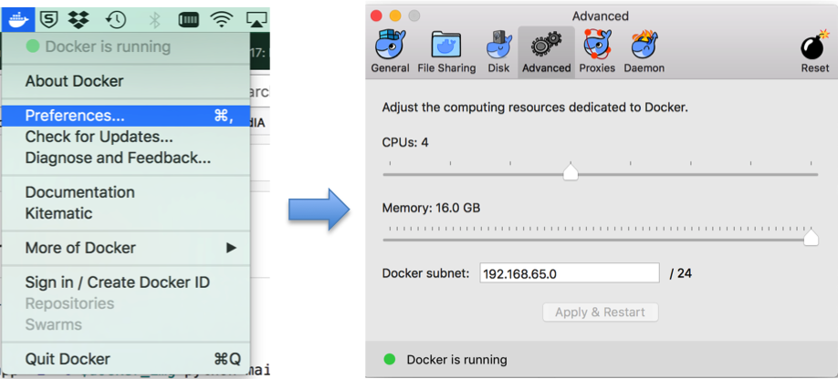
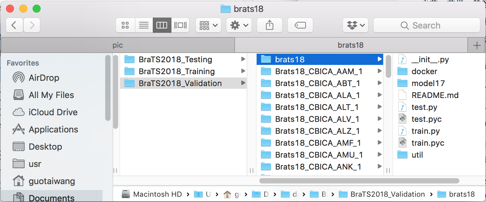

# Automatic Brain Tumor Segmentation using Cascaded Anisotropic CNNs
Dockerfile and supporting files to create a new Docker image from the Source Code at [brats18][github_code18]
for brain tumor segmentation, which is a revision of the original implementation of [brats17][github_code17] according to the following paper:

[github_code18]:https://github.com/taigw/brats18
[github_code17]:https://github.com/taigw/brats17

*Guotai Wang, Wenqi Li, Sebastien Ourselin, Tom Vercauteren. "Automatic Brain Tumor Segmentation using Cascaded Anisotropic Convolutional Neural Networks." In International MICCAI Brainlesion Workshop, pp. 178-190. Springer, Cham, 2017. https://arxiv.org/abs/1709.00382

The [brats18][github_code18] code supports test time augmentation, where the final prediction for a test image is obtained by fusing predictions of multiple transformed versions of that image. This is the main difference from the [brats17][github_code17] code. 

## How to use

1. Download the source code of this repositry, and the source code of [brats18][github_code18] project.

```bash
git clone https://github.com/taigw/brats18_docker.git
git clone https://github.com/taigw/brats18.git
```

2. Build the docker image.

```bash
cd brats18_docker
docker build . < Dockerfile
```

You will get some screen outputs like `Successfully built bc4a4f723ff2` where `bc4a4f723ff2` is the docker image id.

3. Set docker memory to 16G.

Since GPU computing with docker is not implemented, only CPU is used when running the segmentation code in docker. The code requires a large memory and ~300s for segmenting one brain tumor with CPU. Please set the memory for docker to 16G, as illustrated in the following:



4. Open the `./single_prediction.sh` file and edit `directory` and `my_image`.

```bash
# content of ./single_prediction.sh
directory=/Users/guotaiwang/Documents/data/BraTS2018_Validation
my_image=bc4a4f723ff2
mkdir $directory/results
docker run -v $directory:/data --workdir=/usr/src/app -i -t $my_image python /data/brats18/docker/main.py /data/brats18/docker/test_cfg1.txt
```
where `directory` is the dir in which the testing images are stored, such as `BraTS2018_Validation` and `BraTS2018_Testing`. Please set `directory` as full path of the folder containing testing images, and copy the folder `brats18` to $directory. Then the folder should look like:




Set `my_image` as the docker image id obtained in the previous step. Note that each time when you build the docker image, the id may change and `my_image` should be reset accordingly.


5. Now run the bash file to start the segmentation with single prediction (no test-time augmentation).

```bash
bash ./single_prediction.sh
```

The segmentation results will be saved to $directory/results/results1.

6. To use test-time augmentation with multiple predictions. Open the `./multiple_predictions.sh` file and edit `directory` and `my_image`.

```bash
# content of ./multiple_predictions.sh
directory=/Users/guotaiwang/Documents/data/BraTS2018_Validation
my_image=bc4a4f723ff2
mkdir $directory/results
docker run -v $directory:/data --workdir=/usr/src/app -i -t $my_image python /data/brats18/docker/main.py /data/brats18/docker/test_cfg1.txt
docker run -v $directory:/data --workdir=/usr/src/app -i -t $my_image python /data/brats18/docker/main.py /data/brats18/docker/test_cfg2.txt
docker run -v $directory:/data --workdir=/usr/src/app -i -t $my_image python /data/brats18/docker/main.py /data/brats18/docker/test_cfg3.txt
docker run -v $directory:/data --workdir=/usr/src/app -i -t $my_image python /data/brats18/docker/main.py /data/brats18/docker/test_cfg4.txt
docker run -v $directory:/data --workdir=/usr/src/app -i -t $my_image python /data/brats18/docker/main.py /data/brats18/docker/test_cfg5.txt
docker run -v $directory:/data --workdir=/usr/src/app -i -t $my_image python /data/brats18/docker/vote_result.py /data/brats18/docker/vote_result_cfg.txt
```

As an example, five predictions are obtained and then fused into a single prediction here.

7. Now run the bash file to start the segmentation with multiple predictions (test-time augmentation).

```bash
bash ./multiple_predictions.sh
```

The segmentation results will be saved to $directory/results/result_vote.

## Note
The current version of this docker repository only supports cpu-based computation, which is far slower than using gpu. To run the code with GPU, please see non-dockered version of [brats18][github_code18].
